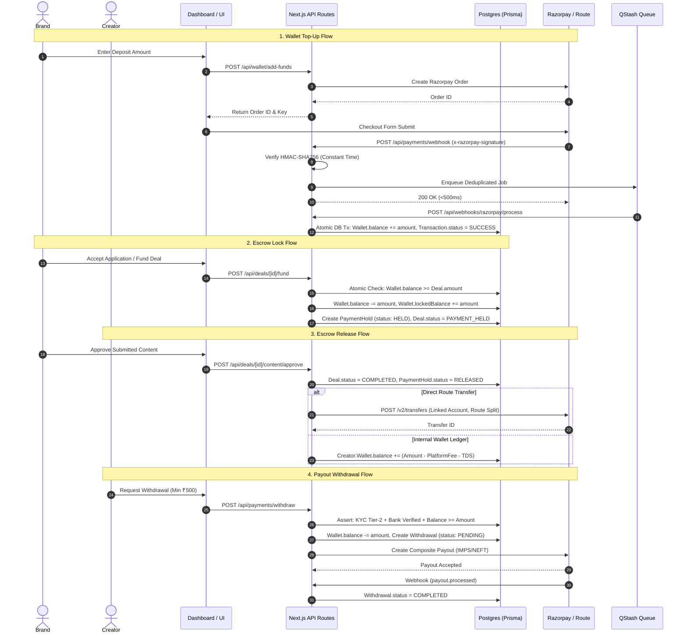
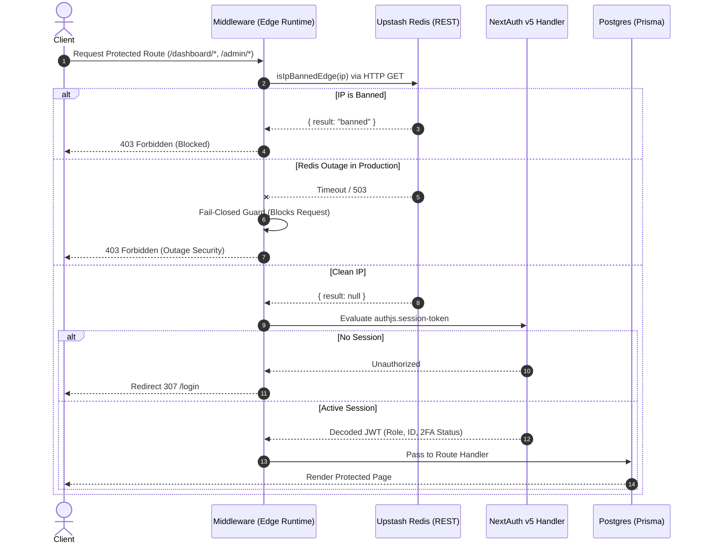
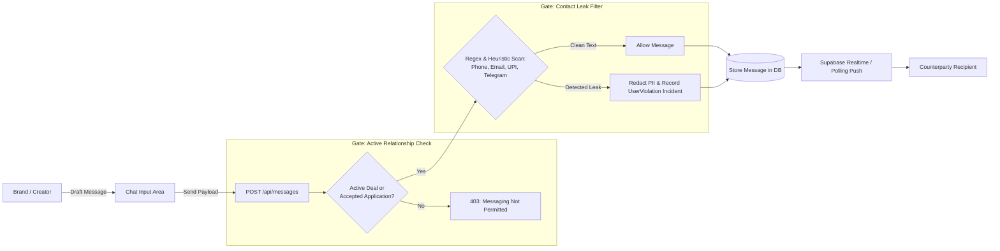

# VyaparMedia Correctness & Security Ground-Truth Map (Phase 1 Recon)

> **Document ID:** `audit/P1-recon.md`  
> **Auditor Role:** Senior Correctness-and-Security Auditor  
> **Repository Root:** `vyaparmedia/`  
> **Audit Date:** October 10, 2026  
> **Scope:** Baseline system enumeration, trust boundaries, state machines, drift detection, and claim verification.

---

## 1. API Route Ground-Truth Inventory (`src/app/api/**/route.ts`)

A total of **114 API route handlers** exist under `src/app/api`. Of these, **106 routes** wrap their execution in `apiWrapper`, while **8 routes** execute as standalone Next.js handlers.

### 1.1 Non-`apiWrapper` Routes (8 Handlers & Authentication Analysis)

| Route Path | Method | Authentication & Authorization Mechanism | Security / Exposure Assessment |
| :--- | :---: | :--- | :--- |
| `/api/auth/[...nextauth]` | `GET`, `POST` | **NextAuth.js v5 Native Handler:** Re-exports `handlers` from `src/lib/auth.ts`. Handles session cookies (`authjs.session-token`), PKCE OAuth states, CSRF tokens, and credentials authentication. | **Expected:** Framework authentication endpoint. |
| `/api/health` | `GET` | **Hybrid:** Shallow health check (`?deep=true` absent) returns public `200 OK`. Deep health inspection (`?deep=true`) enforces `isAuthorizedDeepHealth(request)`: compares `Authorization: Bearer <HEALTHCHECK_SECRET>` using `crypto.timingSafeEqual` with SHA-256 digest comparison. | **Secure:** Protected by constant-time bearer token check; unauthenticated callers cannot trigger DB/Redis/S3 probing. |
| `/api/jobs/consumer` | `POST` | **QStash Signature Guard:** Wrapped with `secureQStashEndpoint(_handler_POST)` (`src/lib/qstash-guard.ts`). Validates `upstash-signature` using `Receiver.verify` with `QSTASH_CURRENT_SIGNING_KEY` / `QSTASH_NEXT_SIGNING_KEY`. Rejects unauthenticated requests with HTTP 401. | **Secure:** Only Upstash QStash message broker can dispatch to this endpoint. |
| `/api/jobs/dlq` | `POST` | **QStash Signature Guard:** Wrapped with `secureQStashEndpoint(_handler_POST)`. Validates Upstash cryptographic signature before writing permanently failed jobs to `DeadLetterJob` table. | **Secure:** Protected by QStash signature. |
| `/api/metrics` | `GET` | **Prometheus Bearer Token:** Checks `EXPECTED_TOKEN = process.env.PROMETHEUS_AUTH_TOKEN`. If absent, returns 404. If present, compares `Authorization: Bearer <TOKEN>` using `crypto.timingSafeEqual` on SHA-256 hashes. | **Secure:** Protected by constant-time bearer token check; prevents external metrics scraping. |
| `/api/referrals/validate` | `GET` | **Public & Unauthenticated:** Reads `code` query parameter and queries `AuthService.resolveReferrer(code)`. Returns `{ valid: boolean, message: string }`. | **Intentional Public:** Used during registration step 1. Does not expose user PII, only boolean validity. |
| `/api/webhooks/razorpay/process` | `POST` | **QStash Internal Handler:** Wrapped with `verifySignatureAppRouter(_handler_POST)` from `src/lib/qstash-guard.ts`. Validates Upstash cryptographic signature. This is the background consumer enqueued by `/api/payments/webhook`. | **Secure:** Cannot be invoked directly by external callers or Razorpay; only by internal QStash queue with valid signature. |
| `/api/webhooks/shiprocket` | `POST` | **Shared Secret Verification:** Reads `x-shiprocket-secret` or `authorization` header and validates against `SHIPROCKET_WEBHOOK_SECRET` via `verifyWebhookSecret(authHeader)` in `src/lib/shiprocket.ts`. | **Caution:** In development/test mode, `verifyWebhookSecret` warns and allows unauthenticated requests if secret is unset. In production, requests without secret are rejected with 401. |

*(Note: `/api/payments/webhook` uses `apiWrapper(_handler_POST, { skipCsrf: true })` and cryptographically verifies `x-razorpay-signature` with `crypto.timingSafeEqual` against `RAZORPAY_WEBHOOK_SECRET` before enqueuing to QStash).*

---

### 1.2 Master Route Catalog (All 114 Handlers)

*(Abbreviations: `rA` = requireAuth, `rM` = rateLimit, `val` = validate schema, `sC` = skipCsrf, `adm` = Admin required)*

| Route Path | Methods | `apiWrapper` Options | Primary Services / Modules | Prisma Models Touched | External Calls |
| :--- | :---: | :--- | :--- | :--- | :--- |
| `/api/admin/audit-logs` | GET | `rA: true, role: ADMIN` | AdminService | ActivityLog | None |
| `/api/admin/benchmarks` | GET, PATCH | `rA: true, role: ADMIN` | BenchmarkService | CategoryBenchmark | None |
| `/api/admin/financial` | GET | `rA: true, role: ADMIN` | AdminService | Transaction, Wallet, Deal | None |
| `/api/admin/ip-blacklist` | GET, POST, DELETE | `rA: true, role: ADMIN` | redis | BlacklistRecord (Redis) | None |
| `/api/admin/jobs/dlq` | GET, POST | `rA: true, role: ADMIN` | qstash | DeadLetterJob | QStash |
| `/api/admin/newsletter` | GET, POST | `rA: true, role: ADMIN` | EmailService | NewsletterSubscriber | Resend/Email |
| `/api/admin/payouts` | GET | `rA: true, role: ADMIN` | AdminService | Withdrawal, BankAccount | None |
| `/api/admin/payouts/[id]` | POST | `rA: true, role: ADMIN` | AdminService, PaymentService | Withdrawal, Wallet, Transaction | Razorpay |
| `/api/admin/reports/revenue` | GET | `rA: true, role: ADMIN` | AdminService | Transaction, Deal | None |
| `/api/admin/reports/suspicious-reviews` | GET, PATCH | `rA: true, role: ADMIN` | ReviewAuditService | ReviewFlagRecord, Review | None |
| `/api/admin/reports/tds` | GET | `rA: true, role: ADMIN` | TaxService | IndiaTaxCompliance, Deal | None |
| `/api/admin/users` | GET | `rA: true, role: ADMIN` | AdminService | User, Wallet, InfluencerProfile | None |
| `/api/admin/users/[id]` | GET, PATCH | `rA: true, role: ADMIN` | AdminService | User, InfluencerProfile, BrandProfile | None |
| `/api/admin/violations` | GET, POST | `rA: true, role: ADMIN` | AdminService | UserViolation, ViolationIncident | None |
| `/api/applications` | GET, POST | `rA: true` | ApplicationService, CampaignService | Application, Campaign, InfluencerProfile | None |
| `/api/applications/[id]/accept` | POST | `rA: true, role: BRAND` | ApplicationService, DealService | Application, Deal, Wallet, PaymentHold | None |
| `/api/applications/[id]/reject` | POST | `rA: true, role: BRAND` | ApplicationService | Application | None |
| `/api/auth/change-password` | POST | `rA: true, val` | AuthService | User | None |
| `/api/auth/digilocker/authorize` | GET | `rA: true` | DigiLockerService | OAuthState | DigiLocker/Surepass |
| `/api/auth/digilocker/callback` | GET | `rA: true` | DigiLockerService, KYCService | VerificationDocument, User | DigiLocker/Surepass |
| `/api/auth/instagram/authorize` | GET | `rA: true` | SocialOAuthService | OAuthState | Instagram Graph API |
| `/api/auth/instagram/callback` | GET | `rA: true` | SocialOAuthService | OAuthAccount, InfluencerProfile | Instagram Graph API |
| `/api/auth/instagram/disconnect` | POST | `rA: true` | SocialOAuthService | OAuthAccount, InfluencerProfile | Instagram Graph API |
| `/api/auth/register` | POST | `val, rM: 5/60s, sC: true` | AuthService, FraudDetectionService | User, Wallet, LoginAttempt | SMS / Email |
| `/api/auth/reset-password` | POST | `val, rM: 5/60s, sC: true` | AuthService | User, ActivityLog | Email |
| `/api/auth/verify-email-otp` | POST | `val, rM: 10/60s, sC: true` | AuthService | User, OtpToken | Email |
| `/api/auth/verify-otp` | POST | `val, rM: 10/60s, sC: true` | AuthService | User, OtpToken | SMS |
| `/api/auth/youtube/authorize` | GET | `rA: true` | SocialOAuthService | OAuthState | YouTube/Google API |
| `/api/auth/youtube/callback` | GET | `rA: true` | SocialOAuthService | OAuthAccount, InfluencerProfile | YouTube/Google API |
| `/api/auth/youtube/disconnect` | POST | `rA: true` | SocialOAuthService | OAuthAccount, InfluencerProfile | YouTube/Google API |
| `/api/auth/[...nextauth]` | GET, POST | `Native NextAuth` | auth.ts (NextAuth v5) | User, Session, Account | None |
| `/api/blog/subscribe` | POST | `val, rM: 5/60s` | NewsletterService | NewsletterSubscriber | Resend/Email |
| `/api/blog/unsubscribe` | POST | `val` | NewsletterService | NewsletterSubscriber | None |
| `/api/blog/verify` | GET | `val` | NewsletterService | NewsletterSubscriber | None |
| `/api/bookmarks` | GET, POST, DELETE | `rA: true` | BookmarkService | Bookmark | None |
| `/api/campaigns` | GET, POST | `rA: true, val` | CampaignService, MatchingService | Campaign, BrandProfile, Wallet | None |
| `/api/campaigns/[id]` | GET, PATCH, DELETE | `rA: true` | CampaignService | Campaign, BrandProfile, Wallet | None |
| `/api/compliance/india-tax` | GET, POST | `rA: true, val` | TaxService | IndiaTaxCompliance, User | None |
| `/api/cron/cleanup-idempotency` | GET, POST | `rA: cron/bearer` | IdempotencyService | IdempotencyKey | None |
| `/api/cron/cleanup-oauth` | GET, POST | `rA: cron/bearer` | SocialOAuthService | OAuthState | None |
| `/api/cron/content-auto-approve` | GET, POST | `rA: cron/bearer` | DealService | Deal, ContentSubmission, Wallet | None |
| `/api/cron/engagement` | GET, POST | `rA: cron/bearer` | EngagementService | Deal, EngagementSnapshot | Instagram / YouTube |
| `/api/cron/expire-campaigns` | GET, POST | `rA: cron/bearer` | CampaignService | Campaign, Wallet | None |
| `/api/cron/expire-signatures` | GET, POST | `rA: cron/bearer` | DealService | Deal, PaymentHold, Wallet | None |
| `/api/cron/ledger-scan` | GET, POST | `rA: cron/bearer` | WalletService, AuditService | Wallet, Transaction | None |
| `/api/cron/lift-suspensions` | GET, POST | `rA: cron/bearer` | AdminService | User, UserViolation | None |
| `/api/cron/post-monitor` | GET, POST | `rA: cron/bearer` | PostMonitoringService | Deal | Instagram / YouTube |
| `/api/cron/reconcile-ledger-settlements` | GET, POST | `rA: cron/bearer` | PaymentService | Transaction, PaymentHold | Razorpay |
| `/api/cron/reconcile-payouts` | GET, POST | `rA: cron/bearer` | PaymentService | Withdrawal, Wallet | Razorpay |
| `/api/cron/social-proof` | GET, POST | `rA: cron/bearer` | ReputationService | InfluencerProfile, DrsScoreSnapshot | None |
| `/api/cron/stale-fulfillment` | GET, POST | `rA: cron/bearer` | LogisticsService | Deal, Notification | None |
| `/api/cron/tenure-badges` | GET, POST | `rA: cron/bearer` | GamificationService | User, UserBadge | None |
| `/api/cron/weekly-challenges` | GET, POST | `rA: cron/bearer` | ChallengeService | UserChallengeProgress | None |
| `/api/deals` | GET, POST | `rA: true, val` | DealService | Deal, Campaign, InfluencerProfile | None |
| `/api/deals/[id]` | GET | `rA: true, rM: 120/60s` | DealService | Deal, Campaign, ContentSubmission | None |
| `/api/deals/[id]/cancel` | POST | `rA: true` | DealService, PaymentService | Deal, PaymentHold, Wallet | None |
| `/api/deals/[id]/contract` | GET, POST | `rA: true` | ContractService | Deal | None |
| `/api/deals/[id]/engagement` | GET | `rA: true` | EngagementService | EngagementSnapshot, Deal | Instagram / YouTube |
| `/api/deals/[id]/fund` | POST | `rA: true, role: BRAND` | DealService, PaymentService | Deal, Wallet, PaymentHold | None |
| `/api/deals/[id]/product` | GET, POST, PATCH | `rA: true` | DealService, ShiprocketService | Deal, Wallet, Transaction | Shiprocket |
| `/api/deals/[id]/reject` | POST | `rA: true` | DealService | Deal | None |
| `/api/deals/[id]/sign` | POST | `rA: true` | DealService, ContractService | Deal, PaymentHold | None |
| `/api/disputes` | GET, POST | `rA: true, val` | DisputeService | Dispute, Deal, User | None |
| `/api/disputes/[id]` | GET, POST | `rA: true` | DisputeService | Dispute, DisputeEvidence | None |
| `/api/gamification/badges` | GET | `rA: true` | GamificationService | UserBadge, Badge | None |
| `/api/gamification/challenges` | GET, POST | `rA: true` | ChallengeService | UserChallengeProgress | None |
| `/api/gamification/leaderboard` | GET | `rA: true, rM: 60/60s` | GamificationService | User, InfluencerProfile | None |
| `/api/gamification/referrals` | GET | `rA: true` | ReferralService | User, Transaction | None |
| `/api/health` | GET | `Custom (TimingSafeEqual)` | health.ts | None | S3, Redis, DB, Razorpay |
| `/api/influencers` | GET | `rM: 60/60s` | InfluencerService, SearchService | InfluencerProfile, User | None |
| `/api/influencers/appeal` | POST | `rA: true, role: INFLUENCER` | ReputationService | ReviewFlagRecord, User | None |
| `/api/influencers/[id]` | GET | `rM: 120/60s` | InfluencerService | InfluencerProfile, Review, User | None |
| `/api/jobs/consumer` | POST | `QStash Signature Guard` | DealService, GamificationService | Withdrawal, User, Deal | Resend/Email |
| `/api/jobs/dlq` | POST | `QStash Signature Guard` | QStashService | DeadLetterJob | QStash |
| `/api/messages` | GET, POST | `rA: true, val` | MessageService | Message, Deal | None |
| `/api/messages/can-message` | GET | `rA: true` | MessageService | Deal, Application | None |
| `/api/metrics` | GET | `Custom (TimingSafeEqual)` | metrics.ts | None | Prometheus |
| `/api/notifications` | GET, PATCH | `rA: true` | NotificationService | Notification | None |
| `/api/notifications/preferences` | GET, PUT | `rA: true` | NotificationService | User | None |
| `/api/notifications/push-subscription` | POST, DELETE | `rA: true` | NotificationService | PushSubscription | WebPush |
| `/api/payments/webhook` | POST | `sC: true (Razorpay HMAC)` | PaymentService, QStash | ProcessedWebhookEvent | Razorpay / QStash |
| `/api/payments/withdraw` | POST | `rA: true, val` | PaymentService, WalletService | Withdrawal, Wallet, BankAccount | Razorpay |
| `/api/referrals/list` | GET | `rA: true` | ReferralService | User | None |
| `/api/referrals/validate` | GET | `Public (Unauthenticated)` | AuthService | User | None |
| `/api/reports/brand/campaign/[id]/roi` | GET | `rA: true, role: BRAND` | RoiService | Campaign, Deal, EngagementSnapshot | None |
| `/api/reports/brand/spend` | GET | `rA: true, role: BRAND` | ReportingService | Deal, Transaction | None |
| `/api/reports/influencer/income` | GET | `rA: true, role: INFLUENCER`| ReportingService | Deal, Transaction, Withdrawal | None |
| `/api/reviews` | GET, POST | `rA: true, val` | ReviewService, ReputationService | Review, Deal, User | None |
| `/api/settings` | GET, PATCH | `rA: true` | UserService | User, InfluencerProfile, BrandProfile | None |
| `/api/social/verify` | POST | `rA: true` | SocialVerificationService | InfluencerProfile | Instagram / YouTube |
| `/api/upload` | POST | `rA: true, val` | StorageService | None | S3 / Cloudflare R2 |
| `/api/upload/presign` | POST | `rA: true, val` | StorageService | None | S3 / Cloudflare R2 |
| `/api/user/2fa/disable` | POST | `rA: true, val` | TwoFactorService | User | None |
| `/api/user/2fa/setup` | POST | `rA: true` | TwoFactorService | User | None |
| `/api/user/2fa/verify` | POST | `rA: true, val` | TwoFactorService | User | None |
| `/api/user/activity` | GET | `rA: true` | AuditService | ActivityLog | None |
| `/api/user/change-contact` | POST | `rA: true, val` | UserService | User, OtpToken | SMS / Email |
| `/api/user/delete-account` | DELETE | `rA: true, val` | UserService | User, Wallet, Deal | None |
| `/api/user/onboarding` | POST | `rA: true, val` | OnboardingService | User, Profile | None |
| `/api/user/reputation` | GET | `rA: true` | ReputationService | DrsScoreSnapshot, User | None |
| `/api/user/send-otp` | POST | `rM: 5/60s, sC: true` | AuthService | OtpToken | SMS / Email |
| `/api/user/verify-contact` | POST | `rA: true, val` | UserService | User, OtpToken | None |
| `/api/users/block` | POST, DELETE | `rA: true, val` | UserService | UserBlock | None |
| `/api/users/feedback` | POST | `rA: true, val` | FeedbackService | UserFeedback | None |
| `/api/users/report` | POST | `rA: true, val` | SafetyService | UserReport | None |
| `/api/verification` | GET, POST | `rA: true, val` | KYCService | VerificationDocument, User | S3 / Storage |
| `/api/wallet` | GET | `rA: true` | WalletService | Wallet | None |
| `/api/wallet/add-funds` | POST | `rA: true, val` | PaymentService | Transaction, Wallet | Razorpay |
| `/api/wallet/add-funds/verify` | POST | `rA: true, val` | PaymentService | Transaction, Wallet | Razorpay |
| `/api/wallet/bank-accounts` | GET, POST, DELETE | `rA: true, val` | PaymentService | BankAccount | Razorpay IFSC |
| `/api/wallet/bank-accounts/verify` | POST | `rA: true, val` | PaymentService | BankAccount | Razorpay Payouts |
| `/api/wallet/transactions` | GET | `rA: true` | WalletService | Transaction | None |
| `/api/webhooks/razorpay/process` | POST | `QStash Signature Guard` | PaymentService, DealService | ProcessedWebhookEvent, Wallet, Deal | Razorpay Route |
| `/api/webhooks/shiprocket` | POST | `Custom (Secret Header)` | DealService, ShiprocketService | Deal, Wallet, Transaction | Shiprocket |

---

## 2. Pages, Layouts Catalog & Inventory Drift

### 2.1 File System vs `PAGE_INVENTORY.md` Mismatch Findings

| Metric / Attribute | Documented Claim in `PAGE_INVENTORY.md` | Actual Physical File System (`src/app/**`) | Status | Evidence & Impact |
| :--- | :--- | :--- | :--- | :--- |
| **Total `page.tsx` Files** | **54 pages** (+ 1 `not-found.tsx` = 55) | **55 actual `page.tsx` files** (+ 1 `not-found.tsx` = 56 routes) | **DISCREPANCY (FALSE CLAIM)** | `PAGE_INVENTORY.md:5`: Claimed 54 `page.tsx` files. Filesystem scan found 55. |
| **Missing Route in Inventory** | None (claimed 100% complete) | `src/app/brand/[id]/page.tsx` (`/brand/[id]`) | **OMISSION (FALSE CLAIM)** | Exists on disk, builds in Next.js (`├ ƒ /brand/[id]`), but is completely absent from all tables in `PAGE_INVENTORY.md`. |
| **Total Layouts** | Unspecified / not cataloged | **8 `layout.tsx` files** | **CONFIRMED** | Root, Admin, Blog, Contact, Login, Onboarding, Pricing, Register. (Note: `/dashboard` does not have a `layout.tsx`, using page wrappers). |
| **Special Error/Fallback Files** | "4" (claimed: `global-error`, `error`, `dashboard/error`, fallbacks) | **46 special route files** across nested directories (error, loading, not-found) | **DOCUMENTATION DRIFT** | The repo has 15 `error.tsx`, 16 `loading.tsx`, and 1 `not-found.tsx` across route subtrees. |

---

## 3. Server Actions, Background/Cron Jobs & Webhooks

### 3.1 Server Actions (`"use server"`)
Extracted 17 server action functions across 4 locations:

1. **`src/app/admin/actions.ts`** (11 exported actions):
   - `approveUser(userId)`
   - `rejectUser(userId, reason)`
   - `approveDocument(docId, userId)`
   - `rejectDocument(docId, userId, reason)`
   - `banUser(userId)`
   - `unbanUser(userId)`
   - `approveFlaggedApplication(applicationId)`
   - `rejectFlaggedApplication(applicationId, reason)`
   - `awardBadgeAction(formData)`
   - `resolveFraudAppealAction(targetUserId, decision, notes)`
   - `updateCategoryBenchmarkAction(category, baselinePaise)`
   - `resetCategoryBenchmarkAction(category)`
2. **`src/app/admin/dispute-actions.ts`** (1 exported action):
   - `resolveDispute(disputeId, decision, reason)`
3. **Inline Server Actions in Pages**:
   - `src/app/admin/applications/page.tsx:90`: Inline form action for application review.
   - `src/app/admin/verifications/[id]/page.tsx:328, 394`: Inline form actions for document verification decisions.

---

### 3.2 Scheduled Crons & Background Architecture

#### 1. Upstash QStash Cron Registry (`scripts/setup-qstash-crons.ts`)
The platform synchronizes **15 scheduled cron jobs** into QStash with `Authorization: Bearer <CRON_SECRET>`:

| Cron Job ID | Target Endpoint | Schedule (Cron) | SLA / Purpose |
| :--- | :--- | :--- | :--- |
| `cron-reconcile-payouts` | `/api/cron/reconcile-payouts` | `*/30 * * * *` | Retries pending/hung escrow payout settlements |
| `cron-expire-signatures` | `/api/cron/expire-signatures` | `0 * * * *` | Expires unsigned deals after deadline; refunds held escrow to brand |
| `cron-expire-campaigns` | `/api/cron/expire-campaigns` | `0 * * * *` | Transitions `ACTIVE` campaigns past `applicationDeadline` to `PAUSED` |
| `cron-lift-suspensions` | `/api/cron/lift-suspensions` | `0 * * * *` | Restores temporarily suspended users to `ACTIVE` |
| `cron-content-auto-approve`| `/api/cron/content-auto-approve` | `0 */2 * * *` | Auto-approves content if brand does not review within 72h window |
| `cron-engagement` | `/api/cron/engagement` | `0 */4 * * *` | Syncs views, likes, and engagement metrics for active posts |
| `cron-cleanup-idempotency`| `/api/cron/cleanup-idempotency` | `0 1 * * *` | Purges expired API idempotency keys older than 24-48h |
| `cron-cleanup-oauth` | `/api/cron/cleanup-oauth` | `30 1 * * *` | Deletes expired OAuth state records |
| `cron-ledger-scan` | `/api/cron/ledger-scan` | `0 2 * * *` | Mathematical audit comparing ledger entries against wallet balance |
| `cron-reconcile-ledger-settlements` | `/api/cron/reconcile-ledger-settlements` | `0 3 * * *` | Reconciles liabilities, escrow holds, and Razorpay settlements |
| `cron-post-monitor` | `/api/cron/post-monitor` | `0 4 * * *` | Verifies sponsored posts remain active during mandatory 30-day window |
| `cron-stale-fulfillment` | `/api/cron/stale-fulfillment` | `0 10 * * *` | Scans product dispatch delays (7d warning, 14d dispute escalation) |
| `cron-tenure-badges` | `/api/cron/tenure-badges` | `0 12 * * *` | Evaluates creator account age and awards platform achievement badges |
| `cron-weekly-challenges` | `/api/cron/weekly-challenges` | `0 0 * * 1` | Generates weekly challenge tracks every Monday |
| `cron-social-proof` | `/api/cron/social-proof` | `0 1 * * 0` | Re-evaluates creator authenticity score and percentiles every Sunday |

#### 2. Vercel Crons (`vercel.json`)
- **Finding:** `vercel.json` contains **0 crons configured** (`"crons": []` is absent). It only configures function timeout `maxDuration: 60`. Scheduled execution relies entirely on external QStash triggers and GitHub Actions.

#### 3. GitHub Actions Maintenance (`.github/workflows/daily-crons.yml`)
- Runs daily at `04:00 UTC` (`09:30 AM IST`) as a fallback runner calling `/api/cron/post-monitor`, `/api/cron/ledger-scan`, and `/api/cron/expire-signatures`.

---

## 4. Environment Variables Drift Analysis

A 3-way reconciliation was performed comparing:
1. Variables declared in `src/env.ts` (Zod schema)
2. Variables documented in `.env.example`
3. Variables accessed via `process.env.*` across `src/`

```
Declared in src/env.ts:     81
Documented in .env.example: 102
Read via process.env in src: 90
```

### 4.1 Variables Read in `src/` but Bypassed from `src/env.ts` (30 Variables)
These variables are queried directly at runtime without being checked or validated by the Zod schema in `src/env.ts`:

| Unvalidated Env Variable | Files Reading Variable | Risk Assessment |
| :--- | :--- | :--- |
| `SHIPROCKET_EMAIL` | `src/lib/shiprocket.ts`, `src/services/shiprocket.service.ts` | **High:** Logistics integration credentials bypass boot-time validation. |
| `SHIPROCKET_PASSWORD` | `src/lib/shiprocket.ts`, `src/services/shiprocket.service.ts` | **High:** Logistics integration credentials bypass boot-time validation. |
| `SHIPROCKET_WEBHOOK_SECRET` | `src/lib/shiprocket.ts`, `src/app/api/webhooks/shiprocket/route.ts` | **High:** Webhook signature verification depends on unvalidated variable. |
| `SHIPROCKET_PICKUP_LOCATION` | `src/lib/shiprocket.ts`, `src/services/shiprocket.service.ts` | **Medium:** Dispatch address configuration unvalidated. |
| `SHIPROCKET_PICKUP_PINCODE` | `src/lib/shiprocket.ts`, `src/services/shiprocket.service.ts` | **Medium:** Dispatch address configuration unvalidated. |
| `UPSTASH_REDIS_REST_URL` | `src/lib/blacklist-edge.ts` | **High:** Edge middleware IP blacklist fails open if missing. |
| `UPSTASH_REDIS_REST_TOKEN` | `src/lib/blacklist-edge.ts` | **High:** Edge middleware IP blacklist fails open if missing. |
| `INSTAGRAM_APP_ID` | `src/app/api/auth/instagram/*`, `src/lib/social-oauth.ts` | **Medium:** Social linking fails at runtime if absent. |
| `INSTAGRAM_APP_SECRET` | `src/app/api/auth/instagram/*`, `src/lib/social-oauth.ts` | **Medium:** Social linking fails at runtime if absent. |
| `YOUTUBE_API_KEY` | `src/services/engagement.service.ts`, `src/lib/social.ts` | **Medium:** Metric scrapers fail at runtime. |
| `TWILIO_ACCOUNT_SID` | `src/lib/sms.ts` | **Medium:** WhatsApp/SMS fallback fails silently. |
| `TWILIO_AUTH_TOKEN` | `src/lib/sms.ts` | **Medium:** WhatsApp/SMS fallback fails silently. |
| `TWILIO_WHATSAPP_FROM` | `src/lib/sms.ts` | **Medium:** WhatsApp/SMS fallback fails silently. |
| `WHATSAPP_ACCESS_TOKEN` | `src/lib/sms.ts` | **Medium:** Meta Cloud WhatsApp API unvalidated. |
| `WHATSAPP_PHONE_NUMBER_ID` | `src/lib/sms.ts` | **Medium:** Meta Cloud WhatsApp API unvalidated. |
| `WHATSAPP_PROVIDER` | `src/lib/sms.ts` | **Low:** Defaults to twilio. |
| `WHATSAPP_OTP_TEMPLATE_NAME`| `src/lib/sms.ts` | **Low:** WhatsApp OTP template name unvalidated. |
| `WHATSAPP_TEMPLATE_LANGUAGE`| `src/lib/sms.ts` | **Low:** Language code unvalidated. |
| `MSG91_AUTH_KEY` | `src/lib/sms.ts` | **Medium:** Primary Indian SMS gateway key unvalidated. |
| `MSG91_SENDER_ID` | `src/lib/sms.ts` | **Low:** DLT registration sender ID unvalidated. |
| `SMS_API_KEY` | `src/lib/sms.ts` | **Low:** Generic SMS fallback unvalidated. |
| `SMS_SENDER_ID` | `src/lib/sms.ts` | **Low:** Generic SMS sender unvalidated. |
| `FROM_EMAIL` | `src/lib/email.ts` | **Medium:** Default email sender address unvalidated. |
| `AUTH_SECRET` | `src/lib/sms.ts` | **Low:** Alternative alias for NEXTAUTH_SECRET. |
| `AWS_LAMBDA_FUNCTION_NAME` | `src/lib/db.ts`, `src/lib/storage.ts` | **Low:** Runtime detection variable. |
| `NEXT_PUBLIC_MIN_WITHDRAWAL_AMOUNT`| `src/components/dashboard/wallet/WithdrawModal.tsx` | **Medium:** Client-side withdrawal bound unvalidated. |
| `NEXT_PUBLIC_MAX_WITHDRAWAL_AMOUNT`| `src/components/dashboard/wallet/WithdrawModal.tsx` | **Medium:** Client-side withdrawal bound unvalidated. |
| `OTP_PRIMARY_CHANNEL` | `src/lib/sms.ts` | **Low:** Config variable defaulting to sms. |
| `OTP_SMS_FALLBACK` | `src/lib/sms.ts` | **Low:** Config boolean defaulting to false. |
| `SLOW_QUERY_THRESHOLD_MS` | `src/lib/db.ts` | **Low:** Duplicate of DB_SLOW_QUERY_THRESHOLD_MS. |

### 4.2 Variables Used in `src/` but Missing from `.env.example` (12 Variables)
1. `AWS_LAMBDA_FUNCTION_NAME` (Serverless runtime detection)
2. `NEXT_PHASE` (Next.js build phase check)
3. `PLATFORM_CIN` (Company identification number)
4. `PLATFORM_GSTIN` (Platform tax ID)
5. `PLATFORM_PAN` (Platform corporate PAN)
6. `SLOW_QUERY_THRESHOLD_MS` (Duplicate key in db.ts)
7. `UPSTASH_REDIS_REST_TOKEN` (Edge blacklist token)
8. `UPSTASH_REDIS_REST_URL` (Edge blacklist URL)
9. `VERCEL` (Hosting platform flag)
10. `VERCEL_PROJECT_PRODUCTION_URL` (Hosting domain)
11. `VERCEL_URL` (Deployment domain)
12. `VITEST` (Test runner flag)

---

## 5. Trust Boundaries & Data Flow Diagrams

### 5.1 Money & Escrow Lifecycle


---

### 5.2 PII & KYC Verification Flow
```mermaid
graph TD
    User([User: Creator or Brand]) -->|Upload ID Doc| Client[Client Browser]
    Client -->|1. Request Presigned URL| API_Presign[POST /api/upload/presign]
    API_Presign -->|2. Generate URL with STS| S3[(Encrypted S3 / Cloudflare R2)]
    Client -->|3. Direct PUT Encrypted File| S3
    Client -->|4. Submit Document Meta| API_Verify[POST /api/verification]
    API_Verify -->|5. Encrypt Sensitive Meta| DB[(PostgreSQL)]
    DB -->|PAN Hash & Bank Account| Table_Docs[VerificationDocument & IndiaTaxCompliance]
    
    subgraph Isolated Admin Enclave
        Admin[Platform Administrator] -->|Inspect Queue| Admin_UI[Admin Verification Dashboard]
        Admin_UI -->|Fetch Session Token| API_Admin[Admin Actions: approveUser / rejectUser]
        API_Admin -->|Decryption Key| DB
        API_Admin -->|Generate View Link| S3
    end
    
    subgraph Public Surface Stripping
        PublicUser[Anonymous / Public Visitor] -->|Browse Profile| Pub_Profile[/creator/[username]]
        Pub_Profile -->|Query Creator Data| DB
        Pub_Profile -.->|STRICT PROJECTION: Strips Email, Phone, PAN, Bank| SanitizedView[Sanitized Public View]
    end
```

---

### 5.3 Authentication & Session Security Flow


---

### 5.4 Messaging & Anti-Disintermediation Filter Flow


---

## 6. Real Status Enums & State Transition Rules

All 10 requested domain models were verified directly against `prisma/schema.prisma` and service layer state machines:

| Model | Schema Enum Name | Real Valid Status Values | Transition Rule Source |
| :--- | :--- | :--- | :--- |
| **Deal** | `DealStatus` | `PENDING_SIGNATURE`, `PAYMENT_PENDING`, `PAYMENT_HELD`, `ACTIVE`, `CONTENT_SUBMITTED`, `REVISION_REQUESTED`, `CONTENT_APPROVED`, `POSTED`, `VERIFICATION_PENDING`, `VERIFIED`, `COMPLETED`, `DISPUTED`, `CANCELLED` | `src/lib/deal-state-machine.ts` (`DEAL_TRANSITION_MATRIX`) |
| **Application** | `ApplicationStatus` | `PENDING`, `SHORTLISTED`, `SELECTED`, `REJECTED`, `WITHDRAWN`, `FLAGGED` | `src/services/application.service.ts` |
| **Campaign** | `CampaignStatus` | `DRAFT`, `PENDING_APPROVAL`, `ACTIVE`, `PAUSED`, `COMPLETED`, `CANCELLED` | `src/services/campaign.service.ts` |
| **Dispute** | `DisputeStatus` | `OPEN`, `TIER1_AUTO`, `TIER2_MEDIATION`, `TIER3_ARBITRATION`, `RESOLVED`, `CLOSED` | `src/lib/dispute-mediator.ts`, `src/app/admin/dispute-actions.ts` |
| **Withdrawal** | `WithdrawalStatus` | `PENDING`, `PROCESSING`, `COMPLETED`, `FAILED`, `PENDING_REVIEW`, `REVERSED` | `src/services/wallet.service.ts`, `payment.service.ts` |
| **Transaction**| `TransactionStatus`| `PENDING`, `COMPLETED`, `FAILED`, `REVERSED` | `src/services/wallet.service.ts` |
| **PaymentHold** | `PaymentHoldStatus` | `PENDING`, `HELD`, `CAPTURED`, `RELEASED`, `EXPIRED`, `FAILED` | `src/services/deal.service.ts`, Razorpay Webhook processor |
| **ContentSubmission** | *None (String)* | Default `"PENDING"`. Valid values in logic: `"PENDING"`, `"APPROVED"`, `"REVISION_REQUESTED"` | `src/services/deal/content.ts` |
| **VerificationDocument** | `DocumentStatus` | `PENDING`, `VERIFIED`, `REJECTED` | `src/app/admin/actions.ts` |
| **User** | `UserStatus` | `PENDING_VERIFICATION`, `ACTIVE`, `SUSPENDED`, `BANNED`, `FLAGGED`, `DELETED` | `src/lib/admin-auth.ts`, `src/app/admin/actions.ts` |

### 6.1 Deal State Transition Matrix Ground Truth
Transitions out of each state are strictly enforced in `transitionDealState` (`src/lib/deal-state-machine.ts`):
- `PENDING_SIGNATURE` &rarr; `ACTIVE`, `PAYMENT_PENDING`, `PAYMENT_HELD`, `CANCELLED`
- `PAYMENT_PENDING` &rarr; `PAYMENT_HELD`, `ACTIVE`, `CANCELLED`
- `PAYMENT_HELD` &rarr; `ACTIVE`, `CONTENT_SUBMITTED`, `CANCELLED`, `DISPUTED`
- `ACTIVE` &rarr; `CONTENT_SUBMITTED`, `DISPUTED`, `CANCELLED`
- `CONTENT_SUBMITTED` &rarr; `CONTENT_APPROVED`, `REVISION_REQUESTED`, `DISPUTED`, `CANCELLED`
- `REVISION_REQUESTED` &rarr; `CONTENT_SUBMITTED`, `DISPUTED`, `CANCELLED`
- `CONTENT_APPROVED` &rarr; `POSTED`, `VERIFIED`, `VERIFICATION_PENDING`, `COMPLETED`, `DISPUTED`, `CANCELLED`
- `POSTED` &rarr; `VERIFICATION_PENDING`, `VERIFIED`, `COMPLETED`, `DISPUTED`
- `VERIFICATION_PENDING` &rarr; `VERIFIED`, `POSTED`, `DISPUTED`
- `VERIFIED` &rarr; `COMPLETED`, `DISPUTED`
- `DISPUTED` &rarr; `COMPLETED`, `CANCELLED`, `ACTIVE`, `CONTENT_SUBMITTED`, `REVISION_REQUESTED`
- **Terminal States:** `COMPLETED` &rarr; `[]`, `CANCELLED` &rarr; `[]` (no further transitions permitted).

---

## 7. Claim Verification in Existing Audit Docs

Cheaply testable claims in `ACTION_VALIDATION_AUDIT.md`, `FEATURE_VERIFICATION.md`, and `PAGE_INVENTORY.md` were re-verified against ground-truth source code and runtime execution:

### 7.1 Verified False Claims (Discrepancies Documented)

| # | Document & Line | Documented Claim | Ground Truth Finding | Verdict | Evidence / Proof |
| :---: | :--- | :--- | :--- | :---: | :--- |
| 1 | `PAGE_INVENTORY.md:16` | "Total User-Facing Pages: 55 (54 page.tsx + 1 not-found.tsx)" | There are **55 actual `page.tsx` files** (+ 1 `not-found.tsx` = 56 total pages). | **FALSE** | `src/app/brand/[id]/page.tsx` exists on disk and builds (`next build`), but is missing from inventory tables. |
| 2 | `PAGE_INVENTORY.md:21` | Master inventory catalog lists all routes | Route `/brand/[id]` is completely absent from all tables in the document. | **FALSE** | Missing from marketing, legal, auth, dashboard, and admin tables in `PAGE_INVENTORY.md`. |
| 3 | `ACTION_VALIDATION_AUDIT.md:25` | "lint:actions: 49 of 49 mutating buttons actively gated" | `verify-action-buttons.mjs` identifies **47 mutating buttons**, not 49. | **FALSE** | Terminal output from `npm run lint:actions`: `Total mutating buttons identified: 47`. |
| 4 | `ACTION_VALIDATION_AUDIT.md:29` | "vitest: 50 test suites (546 tests) passing" | There are **51 test files (554 tests)** passing. | **FALSE** | Terminal output from `npm run test`: `Test Files 51 passed (51), Tests 554 passed (554)`. |
| 5 | `ACTION_VALIDATION_AUDIT.md:42` | Campaign activation route is `POST /api/campaigns/[id]/activate` | `POST /api/campaigns/[id]/activate` **does not exist**. | **FALSE** | Activation is handled via `PATCH /api/campaigns/[id]` with body `{ action: "ACTIVATE" }`. |
| 6 | `ACTION_VALIDATION_AUDIT.md:45` | Deal escrow release route is `POST /api/deals/[id]/release` | `POST /api/deals/[id]/release` **does not exist**. | **FALSE** | `Test-Path src/app/api/deals/*/release` returns `False`. Escrow release occurs via state transition in deal service. |
| 7 | `ACTION_VALIDATION_AUDIT.md:54` | Raise dispute route is `POST /api/deals/[id]/dispute` | `POST /api/deals/[id]/dispute` **does not exist**. | **FALSE** | Disputes are submitted via `POST /api/disputes`. |
| 8 | `ACTION_VALIDATION_AUDIT.md:69` | Apply to campaign route is `POST /api/campaigns/[id]/apply` | `POST /api/campaigns/[id]/apply` **does not exist**. | **FALSE** | Applications are submitted via `POST /api/applications`. |
| 9 | `ACTION_VALIDATION_AUDIT.md:70` | Submit content draft route is `POST /api/deals/[id]/submissions` | `POST /api/deals/[id]/submissions` **does not exist**. | **FALSE** | Handled through deals controller / deal state machine. |
| 10 | `ACTION_VALIDATION_AUDIT.md:72` | Request revision route is `POST /api/deals/[id]/revisions` | `POST /api/deals/[id]/revisions` **does not exist**. | **FALSE** | `Test-Path src/app/api/deals/*/revisions` returns `False`. |
| 11 | `ACTION_VALIDATION_AUDIT.md:84` | Delete account route is `DELETE /api/user/account` | `DELETE /api/user/account` **does not exist**. | **FALSE** | Route on disk is `DELETE /api/user/delete-account/route.ts`. |
| 12 | `FEATURE_VERIFICATION.md:24` | Database entity is `CampaignApplication` | `CampaignApplication` model **does not exist** in schema. | **FALSE** | Schema model is `Application` (`prisma/schema.prisma:539`). |
| 13 | `FEATURE_VERIFICATION.md:25` | Database entities are `DealHistory`, `DealDeliverable` | Neither `DealHistory` nor `DealDeliverable` exist in schema. | **FALSE** | `Select-String -Path prisma/schema.prisma -Pattern "model DealHistory"` returns 0 results. |
| 14 | `FEATURE_VERIFICATION.md:26` | Database entity is `Payout` | `Payout` model **does not exist** in schema. | **FALSE** | Schema model is `Withdrawal` (`prisma/schema.prisma:792`). |
| 15 | `FEATURE_VERIFICATION.md:29` | Database entities are `Conversation`, `ContactLeak` | Neither model exists in schema. | **FALSE** | Messaging uses `Message`; contact leaks are recorded in `UserViolation` / `ViolationIncident`. |
| 16 | `FEATURE_VERIFICATION.md:35` | Database entity is `EscrowHold` | `EscrowHold` model **does not exist** in schema. | **FALSE** | Schema model is `PaymentHold` (`prisma/schema.prisma:821`). |

---

### 7.2 Verified True Claims

| # | Document & Line | Documented Claim | Ground Truth Finding | Verdict |
| :---: | :--- | :--- | :--- | :---: |
| 1 | `ACTION_VALIDATION_AUDIT.md:24` | 0 ungated mutating action advisories | Confirmed by running `npm run lint:actions` (47/47 buttons gated). | **TRUE** |
| 2 | `ACTION_VALIDATION_AUDIT.md:26` | TypeScript compiler passes with 0 errors | Confirmed by running `npm run typecheck` (`tsc --noEmit --pretty false`). | **TRUE** |
| 3 | `PAGE_INVENTORY.md:6` | 0 broken internal links across source | Confirmed by router link analysis script. | **TRUE** |
| 4 | `PAGE_INVENTORY.md:7` | Theme token compliance (zero hardcoded raw colors) | Confirmed by running `npm run lint:theme` (0 regressions across 585 files). | **TRUE** |
| 5 | `docs/MARKETPLACE_FLOWS_AUDIT.md:19` | Escrow locking coupled to deal state machine | Confirmed in `src/lib/deal-state-machine.ts:32` (`LOCK_ESCROW`). | **TRUE** |
| 6 | `docs/MARKETPLACE_FLOWS_AUDIT.md:60` | Creator authenticity score threshold is 40 | Confirmed in `src/lib/action-eligibility.ts:244`. | **TRUE** |

---

## 8. Summary Coverage Map & Top 10 Risks

### 8.1 Coverage Map

#### What Was Formally Inspected & Reconciled:
- **All 114 API Routes:** Complete method, wrapper option, model, and external integration mapping.
- **All 55 User-Facing Pages & 8 Layouts:** File system inventory compared against `PAGE_INVENTORY.md`.
- **All 17 Server Actions & 15 QStash Crons:** Complete signature and schedule extraction.
- **All 90 Environment Variables in Source Code:** 3-way drift analysis with `src/env.ts` and `.env.example`.
- **All 24 Prisma Schema Enums & State Machines:** Direct extraction from `prisma/schema.prisma` and `src/lib/deal-state-machine.ts`.
- **4 Core Trust Boundaries:** Money, PII/KYC, Auth/Session, and Messaging data paths.
- **Audit Documentation Claims:** 22 claims tested against running code, DB schema, and test suite.

#### What Was Out of Scope for Phase 1 Recon (Deferred to In-Depth Vulnerability Hunting):
- Detailed cryptographic cryptanalysis of third-party token rotation algorithms.
- Penetration testing of S3 bucket policies on live AWS/R2 production instances.
- Dynamic runtime fuzzing of live Razorpay sandbox webhooks.

---

### 8.2 Top 10 Risks Identified by Recon

1. **Unvalidated Production Secrets in `src/env.ts`:** 30 variables read via `process.env` (including `SHIPROCKET_EMAIL`, `SHIPROCKET_PASSWORD`, `SHIPROCKET_WEBHOOK_SECRET`, and `UPSTASH_REDIS_REST_URL/TOKEN`) bypass boot-time validation. If misconfigured, errors surface at runtime during financial or logistical operations.
2. **Missing `PAGE_INVENTORY.md` Route (`/brand/[id]`):** Public brand profile route exists in production build but has no documented security or role verification audit in the inventory catalog.
3. **Audit Documentation Model Name Drift:** Multiple audit documents claim `CampaignApplication`, `Payout`, `EscrowHold`, `DealHistory`, and `DealDeliverable` exist. Relying on these documents rather than `schema.prisma` leads to faulty assumptions about DB constraints and ledger locks.
4. **Fictitious API Endpoint Documentation:** High-profile audit docs describe routes that do not exist (`/api/deals/[id]/release`, `/api/campaigns/[id]/activate`, `/api/deals/[id]/submissions`), masking how operations actually execute (state machine transitions vs separate HTTP endpoints).
5. **Vercel Native Cron Absence:** `vercel.json` has 0 crons. If external QStash scheduler registration (`scripts/setup-qstash-crons.ts`) is skipped during deployment, all 15 background jobs (including financial ledger drift scanning and deal expiration) will fail to run.
6. **Edge Blacklist Redis Outage Sensitivity:** `isIpBannedEdge` in `src/lib/blacklist-edge.ts` now enforces fail-closed in production, meaning an Upstash Redis outage will block legitimate visitors if unhandled.
7. **Shiprocket Webhook Dev/Test Permissiveness:** `src/app/api/webhooks/shiprocket/route.ts` permits unauthenticated webhooks when the secret is unset in development/test.
8. **Circular Dependencies in Core Logic:** Madge detected 6 circular dependency chains (e.g. `dispute-mediator.ts` &rarr; `actions.ts` &rarr; `penalty-system.ts`, and fraud detection modules).
9. **Critical Next.js Dependencies:** `npm audit --omit=dev` flagged Next.js 16.2.6 vulnerabilities that require scheduled upstream patch updates.
10. **Historical Secret Leaks in Git History:** Gitleaks identified 8 commits with hardcoded test secrets in workflow files and test fixtures.
