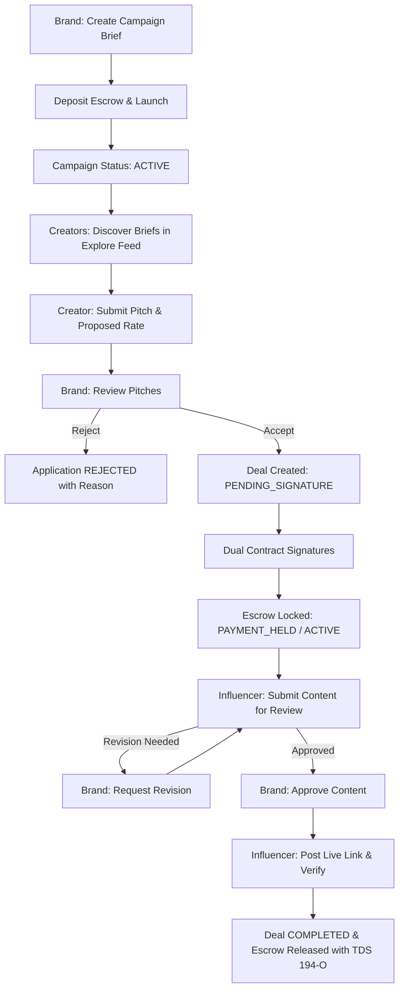

# VyaparMedia Marketplace End-to-End Flows & Edge-Case Audit

Yeh document VyaparMedia influencer marketplace ke saare core user flows, backend state machines, financial escrow lifecycle, aur edge-cases ka comprehensive verification report hai.

---

## 1. Core Flows Overview

---

## 2. Deep Dive: Flow-by-Flow Verification & Edge Cases

### Flow 1: Campaign Creation & Escrow Funding
- **Actors:** Brand
- **Key Files:** `CreateCampaignClient.tsx`, `src/services/campaign/create.ts`, `src/lib/action-eligibility.ts`
- **Steps:**
  1. Brand enters title, description, deliverables (Reel, Post, Story, Video), guidelines, targeting, and per-influencer budget.
  2. Brand verification tier check ensures wallet deposit limit compliance.
  3. Pre-flight check ensures contact details (phone, email, UPI) are blocked in campaign briefs.
  4. Platform platform fees & product handling fees are calculated.
  5. Status becomes `ACTIVE` (or `DRAFT` if saved as draft).

---

### Flow 2: Creator Discovery & Matchmaking (FIXED ✅)
- **Actors:** Influencer / Creator
- **Key Files:** `CampaignsClient.tsx`, `src/services/campaign/list.ts`, `CampaignDiscoveryCard.tsx`
- **Identified Blocker:**
  - *Pehle:* Background filter me `minFollowers`, `hasIg`, aur `profile.categories` hard SQL WHERE clause laga hua tha. Agar kisi naye creator ke 0 followers the ya profile categories alag thi, toh marketplace ke saare campaigns unhe hide ho jaate the (0 results)!
  - *Fix Applied:* Direct invites (`isDirectInvite: true`) ko chhodkar saare active public campaigns ab discoverable hain. Category filters case-resilient (`Fashion` / `fashion` / `FASHION`) kar diye gaye hain. Hard qualification requirements ab application click par inline reason ke sath gate hote hain.
- **Edge Cases Handled:**
  - Brand ne lowercase category daali (`["tech"]`) vs creator profile (`"Tech"`) &rarr; Auto-matched.
  - Newly signed-up creator with 0 followers &rarr; Ab marketplace briefs browse kar sakta hai.

---

### Flow 3: Application Submission & Negotiation
- **Actors:** Influencer
- **Key Files:** `src/services/application/create.ts`, `src/lib/action-eligibility.ts`
- **Checks Enforced:**
  1. `followerAuthenticityScore >= 40` (Fraud / fake follower bot guard).
  2. At least 1 connected social media handle (Instagram ya YouTube).
  3. Anti-spam duplicate check (`@@unique([campaignId, influencerId])`).
  4. Contact details filter (phone, email, UPI pitch me nahi share kar sakte).
  5. Trust Rule Gate & Enterprise risk checks.
- **Budget Mismatch Edge Case:**
  - Creator brand ke budget se alag apna `proposedRate` daal sakta hai.
  - Agar creator ka rate brand budget se match nahi hota, toh deal block nahi hoti — negotiation pitch ke roop me Brand ko submit hoti hai.

---

### Flow 4: Proposal Acceptance & Deal Room Initiation (FIXED ✅)
- **Actors:** Brand
- **Key Files:** `src/services/application/action.ts`, `src/lib/contract-engine.ts`
- **Steps:**
  1. Brand proposal review karta hai.
  2. Brand ke paas option hai: Creator ka `proposedRate` accept kare ya original campaign budget par hire kare.
  3. Brand ke `wallet.pendingBalance` se campaign escrow fund reserve hota hai (`reservedTotalAmount`).
  4. Automated digital contract terms generate hoti hain (deliverables, deadlines, platform fee, net payout).
  5. Deal status `PENDING_SIGNATURE` ban jaata hai.

---

### Flow 5: Campaign Auto-Pause & Reactivation (FIXED ✅)
- **Actors:** Background Cron (`/api/cron/expire-campaigns`), Brand
- **Key Files:** `src/app/api/cron/expire-campaigns/route.ts`, `CampaignDetailClient.tsx`, `src/services/campaign/manage.ts`
- **Identified Blocker:**
  - *Pehle:* Jaise hi `applicationDeadline` expire hoti thi, cron campaign ko `PAUSED` kar deta tha. Frontend me Cancel button sirf `ACTIVE` ke liye tha aur Edit button sirf `DRAFT` ke liye tha — isse brand locked out ho jaata tha.
  - *Fix Applied:*
    1. `CampaignDetailClient.tsx` me `PAUSED` status ke liye **"Edit & Extend Deadline"** aur **"Cancel Campaign"** dono buttons enable kar diye gaye.
    2. `src/services/campaign/manage.ts` me `updateDraftCampaign` ab `PAUSED` campaigns ko update karna allow karta hai.
    3. Agar brand deadline future date me extend karta hai, toh campaign automatically wapas **`ACTIVE`** ho jaati hai!
    4. Agar brand cancel karta hai, toh unspent escrow budget brand ke wallet me unfreeze hokar **turant refund** ho jaata hai.

---

### Flow 6: Content Submission, Review & Revisions
- **Actors:** Influencer & Brand
- **Key Files:** `src/services/deal/content.ts`, `src/lib/action-eligibility.ts`
- **Lifecycle:**
  1. Influencer draft content link submit karta hai (`submitContent`).
  2. Brand review karta hai (`APPROVED` ya `REVISION_REQUESTED`).
  3. Contact details filter review feedback me bhi active rehta hai.
  4. Extra revisions par platform fee / revision charge automate hota hai.

---

### Flow 7: Post Verification & Escrow Release
- **Actors:** Influencer, System, Brand
- **Key Files:** `src/services/deal/verify.ts`, `src/services/payment.service.ts`
- **Lifecycle:**
  1. Content approve hone ke baad Influencer live post URL submit karta hai (`verifyPost`).
  2. System hashtag, account privacy, aur posting deadline verify karta hai.
  3. `PaymentService.processDealCompletion` atomic transaction me:
     - TDS (Section 194-O) deduct karta hai.
     - Net payout influencer wallet me credit karta hai.
     - Platform treasury fee record karta hai.
     - Deal status `COMPLETED` karta hai.
     - Gamification XP & challenge progress award karta hai.

---

### Flow 8: Disputes & Arbitration
- **Actors:** Brand, Influencer, Platform Admin
- **Key Files:** `src/services/dispute.service.ts`, `src/app/admin/disputes/[id]/page.tsx`
- **Rules:**
  - Deal `ACTIVE`, `CONTENT_SUBMITTED`, ya `REVISION_REQUESTED` hone par dispute raise kiya ja sakta hai.
  - Dispute aate hi escrow funds lock ho jaate hain taaki koi party withdraw na kar sake.
  - Admin arbitration portal se Split payout, Full refund to brand, ya Full release to influencer enforce kar sakta hai.

---

## 3. Matrix of Verified Platform States

| Flow / Action | Normal State | Edge Case / Error Condition | Handling Strategy | Status |
| :--- | :--- | :--- | :--- | :--- |
| **Campaign Discovery** | Active briefs in feed | 0-follower creator / lowercase categories | Case-resilient matching; public briefs visible | **FIXED ✅** |
| **Application Deadline** | Submissions open | Deadline expired | Auto-pause + Edit & Extend Deadline enabled | **FIXED ✅** |
| **Campaign Cancellation** | DRAFT cancel | PAUSED campaign cancellation | Remaining uncommitted budget refunded to Brand wallet | **FIXED ✅** |
| **Budget Mismatch** | Exact rate match | Influencer quotes custom rate | Handled as negotiation pitch; Brand can accept or reject | **VERIFIED ✅** |
| **Duplicate Application** | First pitch | Influencer re-applies | Blocked at DB (`campaignId_influencerId` unique index) | **VERIFIED ✅** |
| **Unfunded Campaign Launch** | Wallet has funds | Insufficient wallet balance | Action button disabled with inline deposit CTA | **VERIFIED ✅** |
| **Active Deal Deletion** | Cancel empty campaign | Open deals exist | Cancel blocked until deals are completed or resolved | **VERIFIED ✅** |
| **Dispute Lock** | Direct payout | Dispute raised | Escrow hard-locked until Admin arbitration resolution | **VERIFIED ✅** |

---

## 4. Quality & Compliance Checks
- **TypeScript:** `tsc --noEmit` &rarr; **0 errors**.
- **Action-Button Eligibility:** `npm run lint:actions` &rarr; **0 ungated advisories (47/47 buttons gated)**.
- **Theme Consistency:** `verify-theme-consistency.mjs` &rarr; **0 hardcoded color class violations**.
